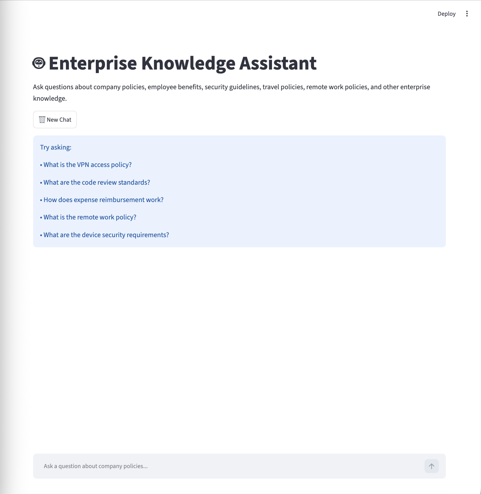

# Enterprise Knowledge Assistant

## Overview

Enterprise Knowledge Assistant is a Retrieval-Augmented Generation (RAG) chatbot that enables users to query enterprise knowledge documents using natural language.

The system combines semantic search, vector embeddings, and a locally hosted large language model to retrieve relevant information and generate grounded responses with source citations.

This project was built using entirely local and open-source technologies, eliminating dependency on external AI APIs while preserving privacy and reducing cost.

---

## Key Features

- Conversational chatbot interface built with Streamlit
- Retrieval-Augmented Generation (RAG)
- Semantic search using FAISS vector database
- Local LLM inference using Ollama + Qwen2
- Source-cited responses
- Chat history support
- Enterprise knowledge base with multiple policy documents
- Fully local deployment with no external AI API dependency

---

## Architecture

```text
Enterprise Documents
        │
        ▼
Document Chunking
        │
        ▼
Sentence Transformer Embeddings
        │
        ▼
FAISS Vector Database
        │
        ▼
Semantic Retrieval
        │
        ▼
Relevant Context
        │
        ▼
Qwen2 (Ollama)
        │
        ▼
Grounded Response
        │
        ▼
Streamlit Chat Interface
```

---

## Technical Highlights

- Indexed 13 enterprise policy documents
- Generated 130+ semantic chunks
- Built an end-to-end RAG pipeline
- Implemented local vector search with FAISS
- Integrated Ollama-hosted Qwen2 model for answer generation
- Added source attribution to improve trust and transparency
- Developed conversational UI with persistent chat history

---

## Tech Stack

### AI / GenAI

- Ollama
- Qwen2
- LangChain
- Retrieval-Augmented Generation (RAG)
- Prompt Engineering

### Vector Search

- FAISS
- Sentence Transformers
- all-MiniLM-L6-v2

### Frontend

- Streamlit

### Programming

- Python

---

## Project Structure

```text
enterprise-knowledge-assistant/
│
├── backend/
│   ├── chat/
│   ├── ingestion/
│   └── vectorstore/
│
├── frontend/
│   └── app.py
│
├── data/
│   └── synthetic_docs/
│
├── docs/
│
├── scripts/
│
├── screenshots/
│
├── requirements.txt
│
└── README.md
```

---

## Installation

### Clone Repository

```bash
git clone <repo-url>
cd enterprise-knowledge-assistant
```

### Create Virtual Environment

```bash
python -m venv venv
source venv/bin/activate
```

### Install Dependencies

```bash
pip install -r requirements.txt
```

### Start Ollama

```bash
ollama serve
```

### Run the Application

```bash
python -m streamlit run frontend/app.py
```

---

## Example Questions

- What is the VPN access policy?
- What are the code review standards?
- How does expense reimbursement work?
- What are the device security requirements?
- What is the remote work policy?
- What employee benefits are available?

---

## Screenshots

### Home Page



 Retrieval

![VPNnshots/vpn-answer.png

### Expense Reimbursement Query

screenshots/expense-reimbursement.png

### Conversational Chat History

screenshots/chat-history.png

---

## Future Enhancements

- FastAPI backend
- Docker support
- Authentication and role-based access
- PDF ingestion
- Hybrid search (BM25 + Vector Search)
- Reranking models
- Evaluation framework for retrieval accuracy

---

## Resume Summary

Built a Retrieval-Augmented Generation (RAG) chatbot leveraging FAISS vector search, Sentence Transformers, Ollama-hosted Qwen2, and Streamlit to deliver document-grounded enterprise knowledge retrieval with source-cited responses.